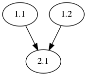
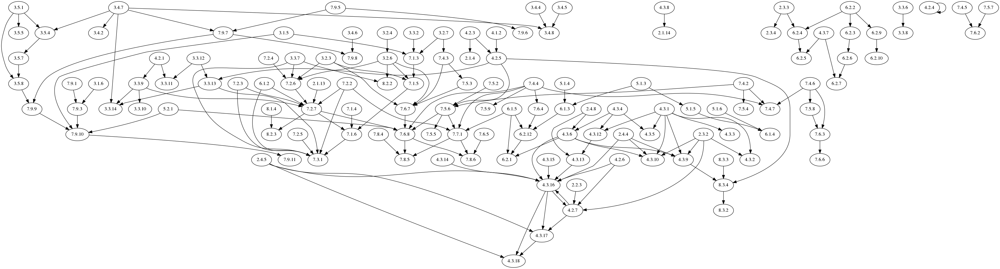

# paper_visualizer
Visualize dependencies among theorems and lemmas of a LaTeX document

## Usage

`-i`,`--input`  
Name of the LaTeX file to use.

`-o`,`--output`,  
Name of the output file.

`-c`,`--config`,  
Name of the config file to use. Defaults to 'config'.
For the format of the config file see below.

`-f`,`--first_chapter`,  
Number of the first chapter. Defaults to 1.

`-n`,`--no_labels`  
If this flag is set LateX labels won't be shown in the graph.

`-a`,`--all_theorems`  
If this flag is set all references will be included in the graph, even those that
do not have a theorem number (e.g. equations, sections).

## Config format

A config file contains two lines. E.g.

```
theorem_names: thm lem
hierarchy: section subsection
```
The first line lists all theorem enviroments that the script should consider.  
The second line lists all commands that affect theorem numbering, from the outermost to the innermost.

The above config file corresponds to the LaTeX code below.

```
\newtheorem{thm}{Theorem}[subsection]
\newtheorem{lem}[thm]{Lemma}
```

## Examples

See the [example directory](example/).


To visualize [example.pdf](example/example.pdf) we run
```
visualizer.py -i example.tex -o example.gv -n -c example_config
```
which results in



Using the script on [this paper](http://shelah.logic.at/files/1144.pdf)
results in


